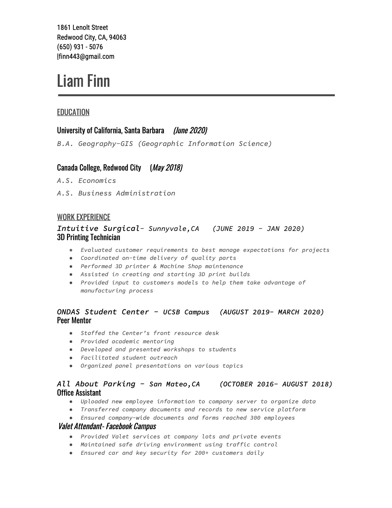

## *Education*
-Graduated from UCSB: June **2020 ** 

-B.A. Geography (GIS)

##### #

-Graduated from Canada Community College: June **2018**

-A.A. in Economics and Business Administration

## *Experience*

-3D Printing Technician: June **2019** through January **2020**

-Performed 3D printer & Machine Shop maintenance

-Assisted in creating and starting 3D print builds

##### #
-Peer Mentor at UCSB ONDAS Center: August **2019** through March **2020**

-Developed and presented workshops to students

-Facilitated student outreach

-Organized panel presentations on various topics

## *Resume*

