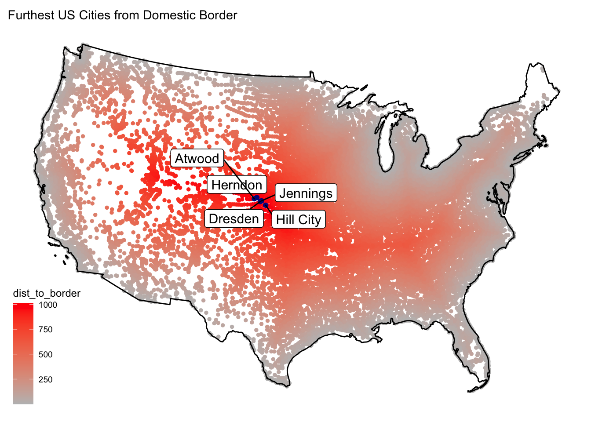

This past summer, I took an introductory Geographic Information Systems/Science course. This course provided me with hands on GIS experience, as well as useful coding skills, specifically using R. In fact, that course taught me how to create this website! Here is a collection of some of my work.

## [Building a project website]()
In this assignment, I built my first website. I created a repository on github, which essentially is a storage space for my projects. Once I created my repo and linked it to RStudio, I created files that provided my website with instructions. This included tasks like where to include text (like this), images, and links.

{width="40%"}

## [Lab 2: Data Wrangling](https://anthonyfinn.github.io/geog-176A-labs/lab-02.html)
This assignment involved data wrangling and visualization practice using raw, real time COVID-19 data from the NY Times. By filtering the raw data to specific states, I generated tables showing the amount of New/Cumulative cases in different states and counties. I created tables to demonstrate these COVID trends across the state of CA. 

{width="40%"}

## [Lab 3: Projections, Distances, and Mapping](https://anthonyfinn.github.io/geog-176A-labs/lab-03.html)
This lab focused on distance calculation and coordinate transformation. By using multiple datasets(US States spatial boundaries, US/CAN/MEX Boundaries, All US Cities) and manipulating these geometries, I calculated and analyzed numerous distances from a large dataset. For example, I created tables that demonstrated city distances from the nearest borders/states, as well as mapping and quantifying border zones.

{width="40%"}

## [Lab 4: Tesselations, Spatial Joins, and Point-in-Polygon](https://anthonyfinn.github.io/geog-176A-labs/lab-04_final.html)
This lab involved a huge amount of data, in which I practiced skills such as writing functions, geometry simplification, generating tessellations to describe a region, and aggregating data. These processes allowed me to visualize the purpose and distribution of dams across the United States. 

{width="40%"}

## [Lab 5:Raster Analysis](https://anthonyfinn.github.io/geog-176A-labs/lab-05.html)
Here, I carried out a flood analysis of a 2016 flooding in Paso, Iowa. I used Landsat Satellite Images and filtered them to my area of interest. Using various band combinations, I plotted multiple images examining this flood, each of which isolated different features of the flood. The image below demonstrates the NDVI (measures plant health) levels. 

{width="40%"}

## [Lab 6: Terrain Analysis](https://anthonyfinn.github.io/liam.finn/lab-6.html)
Using HAND (Height above nearest drainage) flood mapping methodology, we estimated the number of buildings impacted by the 2017 Mission Creek flood. The data included representations of the elevation grid, the river network, and building structures.

{width="40%"}

