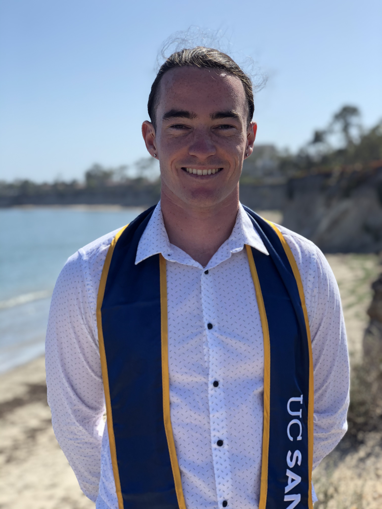

  

# Hi, I'm Liam Finn.

I am recent graduate of UCSB, where I studied Geography/GIS. I most recently worked at Intuitive Surgical in Santa Clara, CA. I worked as a 3D printing technician in the machine shop, where I assisted in creating, designing, and starting 3D print builds. Currently, I am working to improve and develop my GIS analyst/coding skills.

{width="40%"}
